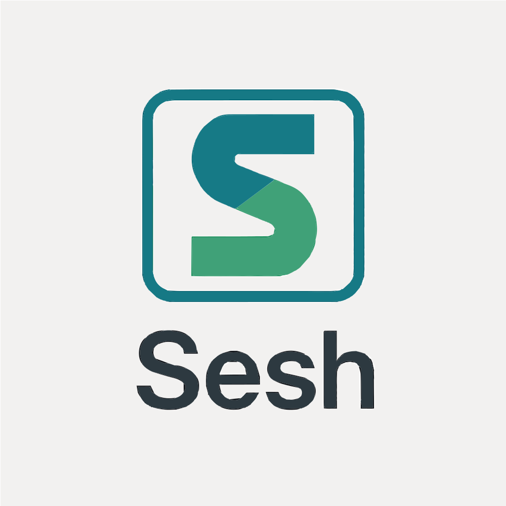

# Sesh

  

Sesh is a mono-repo for managing PA/QV documentation.  
It includes setup for **ESLint**, **Prettier**, **Husky hooks**, branching rules, GitHub workflows (CI/CD), and issue/PR templates.

This serves as the foundation for future implementations (React/Laravel) with Keycloak integration.
